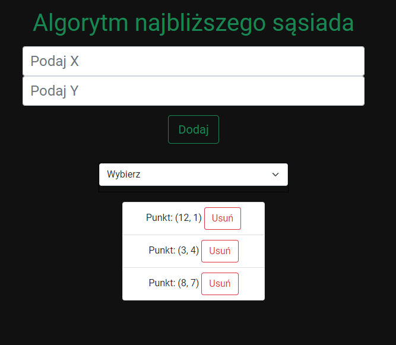

## Spis Treści
* [Informacje o projekcie](#informacje-o-projekcie)
* [Jak działa](#jak-działa)
* [Technologie](#technologie)
* [Jak uruchomić projekt?](#jak-uruchomić-projekt)

## Informacje o projekcie
Projekt rozwiązuje Problem komiwojażera, który polega na pokonaniu drogi przez punkty w optymalny sposób. W wykonaniu projektu posłużyłem się aplikacją internetową, ponieważ znam technologię Canvas, która umożliwia pokazanie drogi graficznie a bardzo zależało mi na tym.

## Jak działa
Program do pobiera od użytkownika punkty X i Y, które w późniejszej fazie będzie mógł wykorzystać w liście select. Aby lista wyboru pokazała się użytkownikowi wymagane jest podanie co najmniej 3 punktów.



Możemy usunąć punkt z listy poprzez przycisk usuń.

Kiedy już wybierzemy interesujący nasz punkt na liście niżej ukaże się:
* Koszt pokonanej drogi
* Optymalna trasa ukazana w punktach
* Podgląd graficzny trasy do pokonania


## Technologie
Projekt stworzyłem przy użyciu:
* Framework javascript React
* Tailwind.css 
	
## Jak uruchomić projekt?
Wersja skompilowana znajduje się w katalogu build

Aby uruchomić program na w wersji nieskompilowanej  potrzebna jest instalacja Node.js: [Link do pobrania](https://nodejs.org/en/)

Następnie należy wejść folder i uruchomić

```
$ cd ../algoritm_neighbour
$ npm start
```